#Predicting Loan Defaults  
by Stephanie Duncan  
11th March 2021

# Project Objective

This project will include analysis to identify trends and give insights into factors which affect default rates on LendingClub loans. Data visualisations will be created to give LendingClub a clear visualisation of insights, as well as a predictive model to help identify who LendingClub should lend to in the future.

The data has been provided by LendingClub (open source) and covers 2007 to 2011. Data cleaning, analysis and modelling will be carried out in Python.

# Data Cleaning

The cleaning script can be accessed 
[here.](https://github.com/stephanieduncan/predicting_defaults_project/blob/main/cleaning_script/cleaning_script.ipynb)

There were over 114 variables in the dataset. As the objective of the project was to generate a model to predict default rates on the loans, many variables were removed which gave information on a loan after it was granted/approved. 

* Bias - to avoid bias the zip code variable was removed. The state variable was kept to carry out analysis on mean incomes and the number of applicants who took out loans in each state.

* Missing Values
	* There were many columns and rows which only contained missing values which were dropped.
	* The employement length variable had a large quantity of missing values. These could have been interpretted as "Unemployed". However, for the avoidance of doubt, these rows were also dropped from the dataset.

* Variables with single values - these would not give much insight so were also removed from the dataset.

# Data Analysis

The analysis script can be accessed [here](https://github.com/stephanieduncan/predicting_defaults_project/blob/main/analysis/analysis.ipynb).

## Loan Status

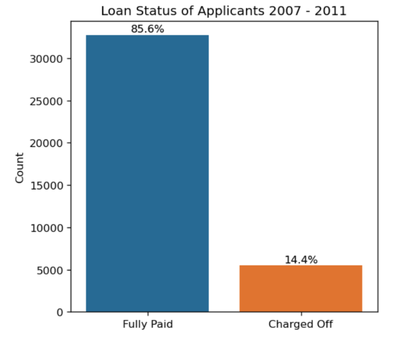

Only 85.6% of all loans are fully paid so there is room for improvement here.

## Purpose of Applications

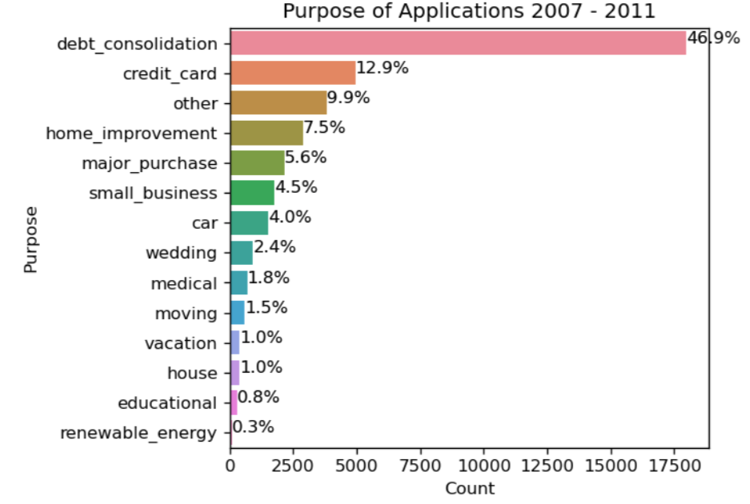

Debt Consolidation is by far the reason most people apply for a loan. 

## Home Ownership

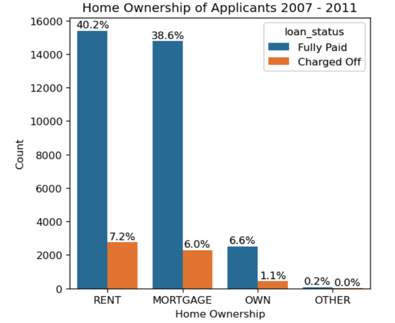

Those who rent form the highest proportion of all applications, followed by mortgage then those who own their home outright.

## Employment Length

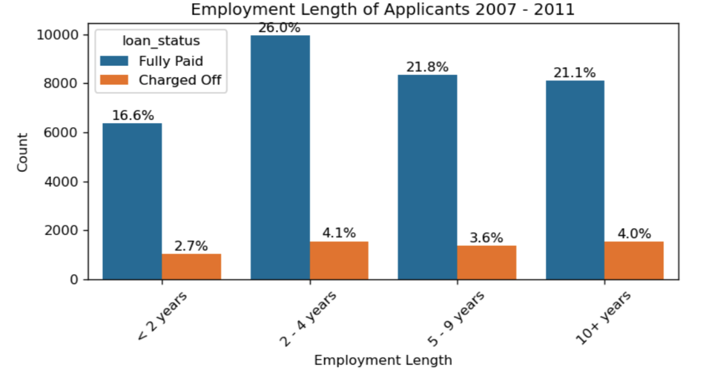

The majority of applicants have been employed between 2-4 years. However, the band which has the highest proportion of loans that were charged off is those who have been in employment 10 years of more.

## Fico Score

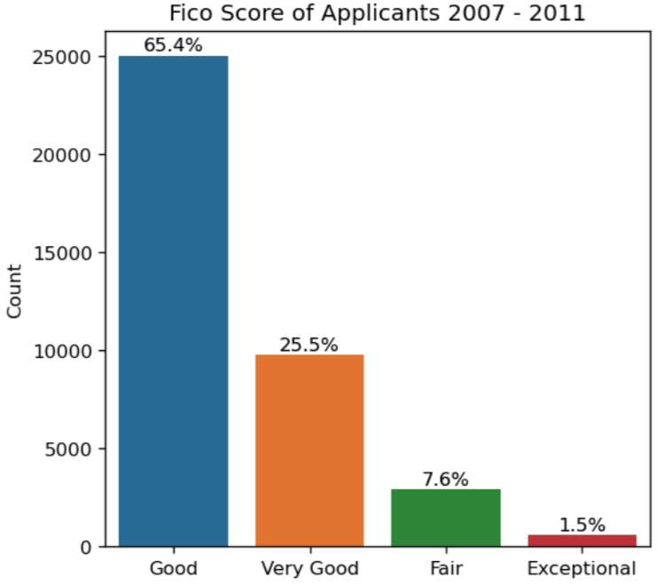

As expected those with a good and very good fico score would be granted a loan. There a no applicants with a poor score.

### Fico Against Loan Status

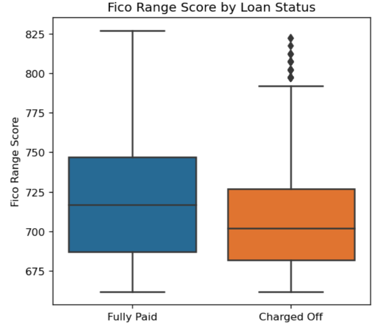

The boxplot shows the those with a higher fico range score were more likely to have fully paid their loan than those with a lower fico score.

### Fico Score Table

The table used to categorise the numerical variables can be seen below:

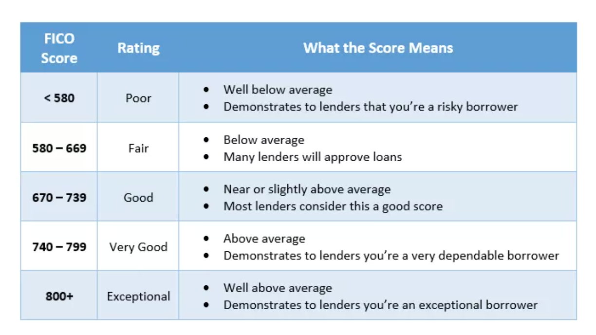

Source of Fico Scores:- [https://www.investopedia.com](https://www.investopedia.com/terms/f/ficoscore.asp#:~:text=Understanding%20FICO%20Scores,-FICO%20is%20a&text=The%20overall%20FICO%20score%20range%20is%20between%20300%20and%20850)

## Verification Status

Verification status indicates whether income was verified by the lending company. 
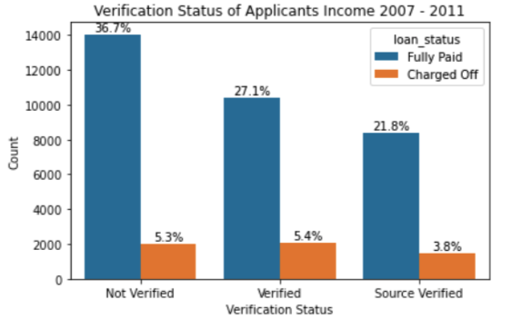

There are a high proportion of applicants who had not had their income verified. However, this category had the lowest proportion of charged off loans from that category.

## Applications Over Time

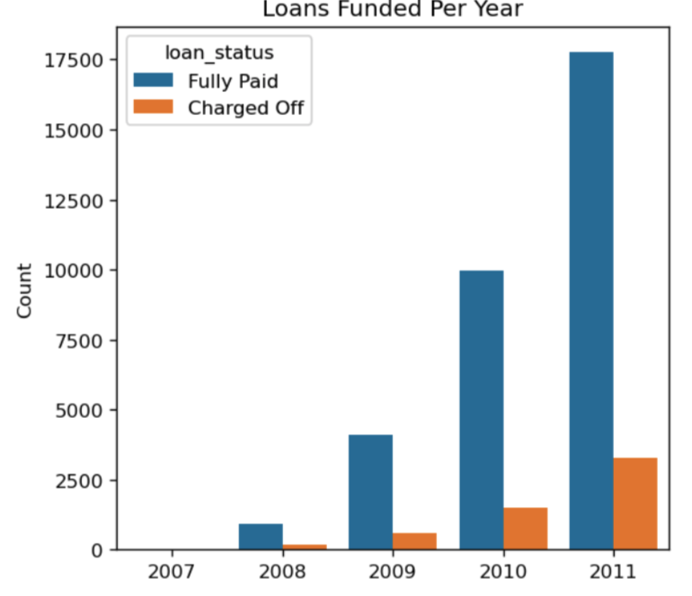

We can see that applications are increasing over time continuously.

## Interest Rate

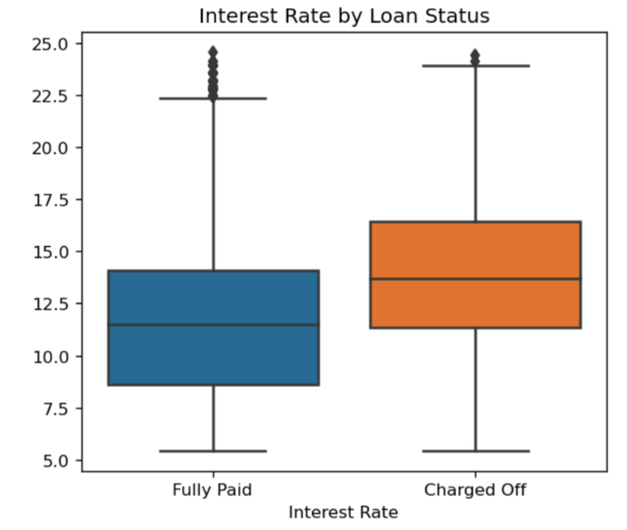

Loans with higher interest rates are more likely to be charged off.

## States

Most applicants are from California (almost double that of the second highest - New York). 

### Mean Income of States

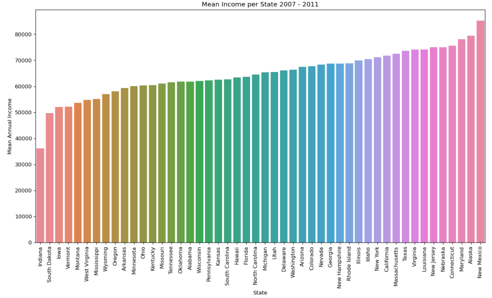

For some states with a lower mean income, the application rate is higher but this is not a common trend for all.

## Predictive Models with Machine Learning

Modelling script can be found [here](https://github.com/stephanieduncan/predicting_defaults_project/blob/main/model/model.ipynb).

Three Predictive Models were generated with machine learning in Python to determine which would give the best result.

* Logistic Regression with Standard Scaling
* Decision Tree
* Random Forest

**Target Variable (Loan Status)** - Fully Paid or Charged Off where encoded as Fully Paid == 1 and Charged Off ==  0 for the purpose of modelling.

**Predictors** - Categorical variables were converted to dummy variables.

**Panda's Profiling** showed the annual income variable is highly skewed so the log-transform of the values was taken.

**Test/Train Split** - conventional 80/20 split was used.

**Threshold** - conventional value of 0.5 used.

## Logistic Regression Model Results

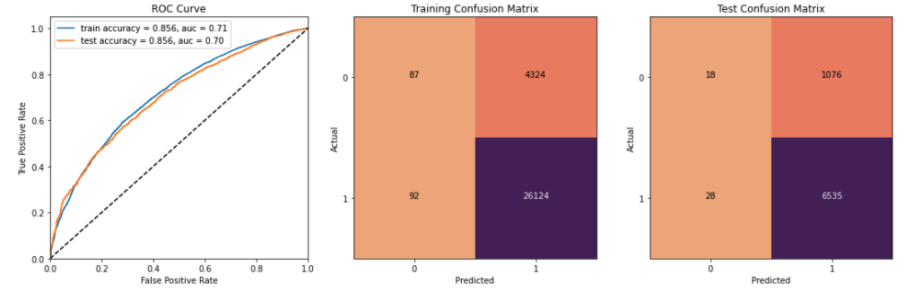

Training ROC is better than test, as expected. Comparison of the Confusion Matrices shows that the test matrix has a lower False Positive Rate and True Negative Rate, as well as a higher False Negative (application was predicted to default but was paid). 

There is room for improvement with regards to the model as the ROC value obtained is only 0.7. 

## Correlation between Predictors

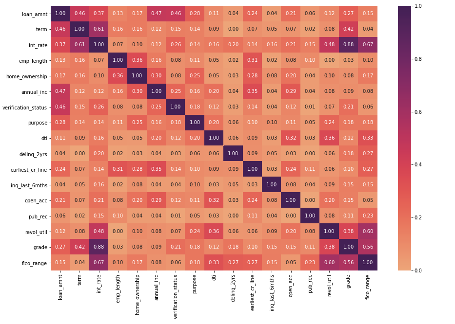

Grade was removed from the test and training data as it was highly correlated with interest rate (0.88).

## Feature Importance

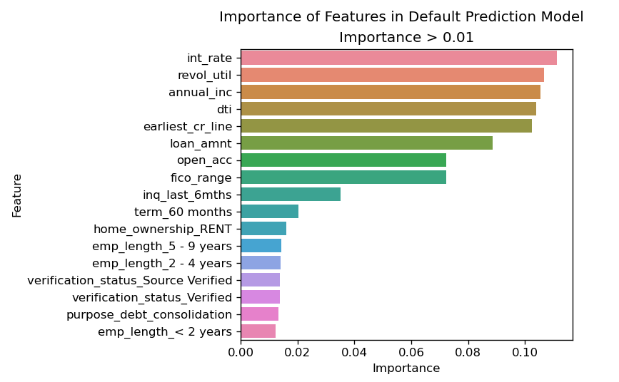

## Model Comparison

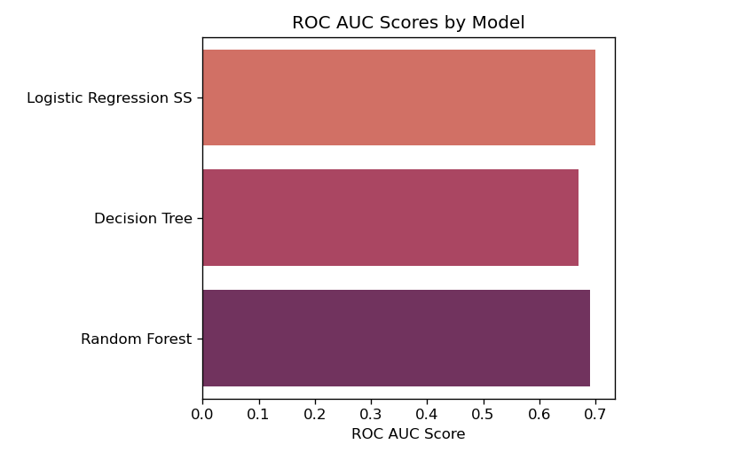

From the ROC AUC scores, I would use the logistic regression model with standard scaling as the result was 0.7. Whereas the Decision Tree and Random Forest models gave a result below 0.7.

## Summary

Features of high importance in default prediction:

* Interest Rate - loans with higher rates more likely to be charged off
* Revolution Credit Utilization Rate
* Annual Income
* Debt to Income Ratio

