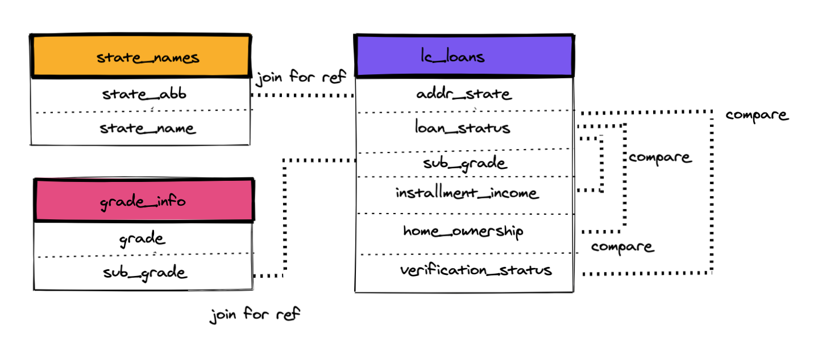

Author: Stephanie Duncan  
Date: 01/03/2021  
Project: Predicting Loan Defaults

# Analysis Plan

### Business Requirement
LendingClub are concerned about the default rate on their loans and would like to gain an understanding on applications which are more likely to lead to loan default, as well as those which are more likely to be paid off in full. 

### Project Outline

This project will include analysis to identify trends and give insights into factors which affect default rates on LendingClub loans. Data visualisations will be created to give LendingClub a clear visualisation of insights, as well as a predictive model to help identify who LendingClub should lend to in the future. 

The analysis will be documented in the form of a report and a presentation will be given to LendingClub, to ensure appropriate sharing once the project is complete. All cleaning, analysis and documentation files will also be held in a [GitHub](https://www.github.com/stephanieduncan/predicting_defaults_project) repository.

### Data
The data used is provided by LendingClub, an online loan provider, who also provided a data dictionary. There are three datasets which will be used:

* Loans - containing information on loans between 2008 and 2011.
* Grades - showing the grades which relate to subgrades.
* States - showing the full names which relate to each state abbreviation.

### Data Quality
The data has missing values, as well as various columns with free-form text fields which means data cleaning and wrangling will be imperative before carrying out any analysis.

### Bias
The dataset contains zip codes as a data variable, which may contribute to bias when building a predictive model and should be removed.

### Data Structure
The data sets are linked as both the grades and states datasets can be merged with the loans dataset. The loans dataset contains state abbreviation and grade fields which the grades and states datasets have further information on.

### Feature Engineering
After taking an initial look at the data, there are fields which give an individual's annual income, as well as the monthly installment amount of an approved loan. I will create a variable which shows the monthly repayment expense as a percentage of monthly income, which will then be used to compare the correlation between the target variable 'loans status'.

### Data Model Diagram 
#### Predicting Loan Defaults for LendingClub

* How do defaults differ between states?
* Are home ownership and loan status related?
* Are grades and loan status related?
* How does the monthly repayment expense represented as a percentage of monthly income relate to loan status?

